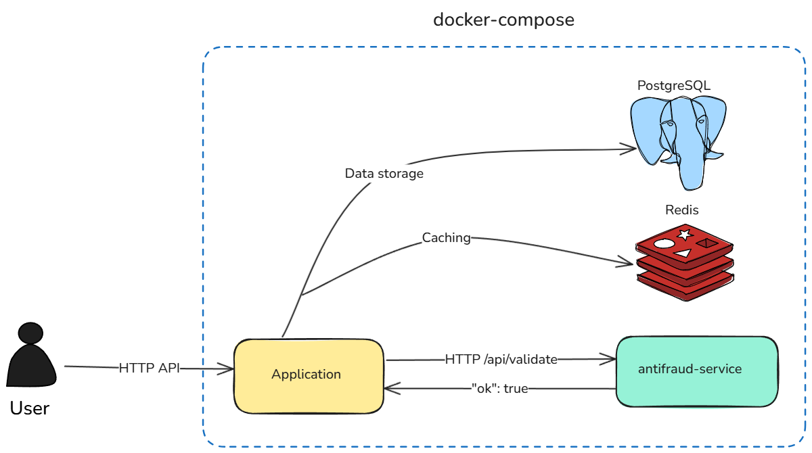

# Promo Code API

[](https://github.com/RandomProgramm3r/Promo-Code-API/actions)
[](https://github.com/astral-sh/ruff)
[](https://codecov.io/github/RandomProgramm3r/Promo-Code-API)

The application provides an HTTP API for companies and end-users, is integrated with an external anti-fraud service, and uses PostgreSQL and Redis for data storage and caching.


<picture>
    <source media="(prefers-color-scheme: dark)" srcset="media/black_schema.excalidraw.png" />
    <source media="(prefers-color-scheme: light)" srcset="media/white_schema.excalidraw.png" />
    
</picture>

## 📜 Table of Contents
- [📝 About the Application](#-about-the-application)
- [✨ Key Features](#-key-features)
- [🛠️ Tech Stack](#-tech-stack)
- [📋 Prerequisites](#-prerequisites)
- [🚀 Installation and Setup](#-installation-and-setup)
- [⚙️ Environment Variables](#️-environment-variables)
- [📄 API Specification](#api-specification)
- [🧭 API Endpoint Examples](#-api-endpoint-examples)
- [🧪 Testing](#-testing)


---

## 📝 About the Application

This document outlines the functionality of the **Promo Code API**, a comprehensive platform designed to connect businesses with end-users through promotional offers. The application is logically divided into two primary sections: a **Business-to-Business (B2B)** interface for companies to manage their campaigns and a **Business-to-Consumer (B2C)** interface for users to discover, interact with, and activate promotions.

---

## ✨ Key Features

This platform provides a comprehensive solution for managing promotional campaigns, with a clear separation between B2B and B2C interfaces.

* **👤 Dual Account System:** Supports separate registration and authentication for **Companies (B2B)** and **Users (B2C)**. The same email can be used for both a company and a user account.

* **🔐 Secure Authentication & Authorization:**
    * **JWT-based authentication** for all protected endpoints (`Authorization: Bearer {token}`).
    * Utilizing **Argon2** hashing algorithm**.
    * Successful sign-in **invalidates all previously issued tokens** for that specific account.
    * Strict ownership checks ensure companies and users can only access and manage their own resources (promos, comments, etc.).

* **📈 Advanced B2B Promo Management:**
    * **Flexible Promo Creation:** Supports two distinct types:
        * `COMMON`: A single, reusable code (e.g., `SUMMER-SALE-20`) with a configurable usage limit.
        * `UNIQUE`: A list of unique, single-use codes for tracking specific campaigns.
    * **Precise Audience Targeting:** Define rules for each promo based on user **age** and **country**.
    * **Powerful Listing & Filtering:** Retrieve promo lists with pagination, case-insensitive filtering (by country), and sorting (by start/end date).
    * **Performance Analytics:** A dedicated endpoint (`/stat`) provides detailed activation statistics for each promo, broken down by country.

* **🛍️ Rich B2C User Experience:**
    * **Personalized Promo Feed:** Users get a curated feed of active promos that match their profile's targeting settings.
    * **Robust Activation Logic:** A promo can only be activated if it is active, the user matches targeting rules, usage limits are not met, and a mandatory **anti-fraud check** passes.
    * **Community Interaction:** Users can **like/unlike** promos and engage in discussions through a full **CRUD system for comments**.
    * **Activation History:** Users can view a complete history of all the promo codes they have previously activated.

* **🛡️ Core System & Reliability:**
    * **Anti-Fraud Integration:** Every activation attempt is validated by an external anti-fraud service. Results are **persistently cached in Redis** to optimize performance.
    * **Idempotent Actions:** Operations like liking or unliking a promo are idempotent, ensuring repeated requests do not cause unintended side effects.
    * **Health Check:** A simple `GET /api/ping` endpoint to verify service availability.

---

## 🛠️ Tech Stack

-   **Backend:** Python, Django, Django REST Framework
-   **Database:** PostgreSQL
-   **Caching:** Redis
-   **Containerization:** Docker, Docker Compose
-   **External Service:** Antifraud-service

---

## 📋 Prerequisites

- **Docker:** ≥ 27.3.1
- **Docker Compose:** ≥ 2.30 
- **Git:** ≥ 2.44.0 

## 🚀 Installation and Setup

The application and all its dependencies are launched using Docker Compose and configured via environment variables.

1.  **Clone the repository:**
    ```bash
    git clone https://github.com/RandomProgramm3r/Promo-Code-API.git
    cd Promo-Code-API
    ```

2.  **Create and configure the `.env` file:**
    Copy the `.env.example` file to `.env`. The `docker-compose.yml` is configured to use these variables for all services.
    ```bash
    cp .env.example .env
    ```

3.  **Run the application:**
    Execute the following command in the project's root directory to build the images and run the containers in the background:
    ```bash
    docker-compose up -d --build
    ```

4.  **Apply database migrations:**
    ```bash
    docker-compose exec web sh -c "cd promo_code && python manage.py migrate"
    ```

    After a successful launch, the main service will be available on the host machine at **`http://localhost:8000`**.

---

## ⚙️ Environment Variables

All project configuration is managed through an `.env` file.

* `DJANGO_SECRET_KEY`: A secret key for a particular Django installation.
* `DJANGO_DEBUG`: Toggles Django's debug mode (`True` / `False`).
* `DJANGO_ALLOWED_HOSTS`: A list of strings representing the host/domain names that this Django site can serve.

* `POSTGRES_USERNAME`: Username for PostgreSQL connection.
* `POSTGRES_PASSWORD`: Password for PostgreSQL connection.
* `POSTGRES_HOST`: Host for PostgreSQL connection (e.g., `db`).
* `POSTGRES_PORT`: Port for PostgreSQL connection (e.g., `5432`).
* `POSTGRES_DATABASE`: The name of the database to use.

* `REDIS_HOST`: Host for Redis connection (e.g., `redis`).
* `REDIS_PORT`: Port for Redis connection (e.g., `6379`).

* `ANTIFRAUD_ADDRESS`: The address (domain or IP) and port of the anti-fraud service API (e.g., `http://antifraud:9090`).


## 📄 API Specification

The application's REST API is implemented strictly according to the provided OpenAPI specification file, `api.yml`.


## 🧭 API Endpoint Examples

## Health Check

| Method | Endpoint    | Description                     | Auth            |
| :----- | :---------- | :------------------------------ | :-------------- |
| GET     | `/api/ping` | Check if the service is alive.  | None            |

---

## B2B (Company) Endpoints

### Authentication

| Method | Endpoint                       | Description                                                       | Auth  |
| :----- | :----------------------------- | :---------------------------------------------------------------- | :---- |
| POST   | `/api/business/auth/sign-up`   | Register a new company (email, password, name).                   | None  |
| POST   | `/api/business/auth/sign-in`   | Authenticate company, issue new token (TTL 1–24h), revoke old one. | None  |

### Promo Management

| Method  | Endpoint                             | Description                                                                                       | Auth         |
| :------ | :----------------------------------- | :------------------------------------------------------------------------------------------------ | :----------- |
| POST    | `/api/business/promo`                | Create new promo code (COMMON or UNIQUE) with optional targeting.                                 | Bearer Token |
| GET     | `/api/business/promo`                | List your promos with filtering (by country), sorting, and pagination.                            | Bearer Token |
| GET     | `/api/business/promo/{id}`           | Get promo details by ID (must belong to your company).                                           | Bearer Token |
| PATCH   | `/api/business/promo/{id}`           | Update promo by ID (all fields, including `target` structure, are replaced).                      | Bearer Token |
| GET     | `/api/business/promo/{id}/stat`      | Retrieve activation statistics per country (sorted lexicographically by country code).           | Bearer Token |

---

## B2C (User) Endpoints

### Authentication & Profile

| Method | Endpoint                    | Description                                                    | Auth  |
| :----- | :-------------------------- | :------------------------------------------------------------- | :---- |
| POST   | `/api/user/auth/sign-up`    | Register a new user (email, password).                         | None  |
| POST   | `/api/user/auth/sign-in`    | Authenticate user, issue new token (TTL 1–24h), revoke old one. | None  |
| GET    | `/api/user/profile`         | Get your user profile.                                         | Bearer Token |
| PATCH  | `/api/user/profile`         | Update your profile (partial update).                          | Bearer Token |

### Promo Feed & Details

| Method | Endpoint                         | Description                                                                      | Auth         |
| :----- | :------------------------------- | :------------------------------------------------------------------------------- | :----------- |
| GET    | `/api/user/feed`                 | Get list of active promos (no code values revealed).                             | Bearer Token |
| GET    | `/api/user/promo/{id}`           | Get details for one promo (no code value revealed).                              | Bearer Token |

### Activation, History, Likes & Comments

| Method | Endpoint                                          | Description                                                                                         | Auth         |
| :----- | :------------------------------------------------ | :---------------------------------------------------------------------------------------------------| :----------- |
| POST   | `/api/user/promo/{id}/activate`                  | Activate a promo (returns actual code, checks anti-fraud and targeting).                             | Bearer Token |
| GET    | `/api/user/promo/history`                        | Get history of all your activated promos.                                                            | Bearer Token |
| POST   | `/api/user/promo/{id}/like`                      | Like a promo code (idempotent).                                                                      | Bearer Token |
| DELETE | `/api/user/promo/{id}/like`                      | Unlike a promo code (idempotent).                                                                    | Bearer Token |
| POST   | `/api/user/promo/{id}/comments`                  | Add a comment to a promo.                                                                            | Bearer Token |
| GET    | `/api/user/promo/{id}/comments`                  | List comments for a promo (supports pagination).                                                     | Bearer Token |
| GET    | `/api/user/promo/{id}/comments/{comment_id}`     | Get a single comment by ID.                                                                          | Bearer Token |
| PUT    | `/api/user/promo/{id}/comments/{comment_id}`     | Update your own comment.                                                                             | Bearer Token |
| DELETE | `/api/user/promo/{id}/comments/{comment_id}`     | Delete your own comment.                                                                             | Bearer Token |

---

## 🧪 Testing

To run the tests, launch the application and run the following command from the project's root directory. The command will run the tests inside the container of the running application  (`web`).

```bash
docker-compose up -d
docker-compose exec web sh -c "cd promo_code && python manage.py test -v 2"
```
